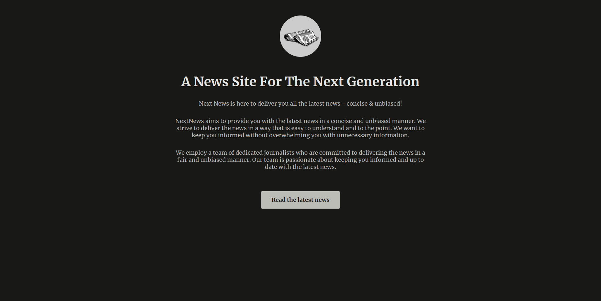
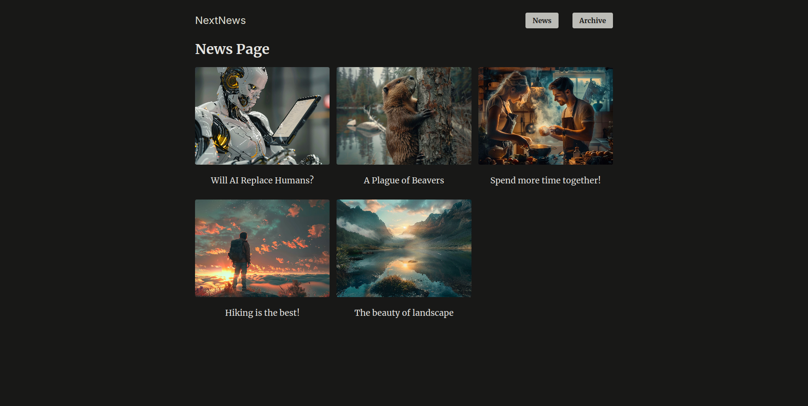

# NEXTNEWS

## Description

This is a [Next.js](https://nextjs.org/) project created during the course ["Next.js & React - The Complete Guide"](https://www.udemy.com/course/nextjs-react-the-complete-guide/) on Udemy.

## Technologies and additional dependencies:

| Tool | Description |
| :-------------:|--------------|
| [Next.js](https://nextjs.org/) | React framework |
| [React](https://reactjs.org/) | JavaScript library for building user interfaces |
| [TypeScript](https://www.typescriptlang.org/) | JavaScript superset |
| [better-sqlite3](https://www.npmjs.com/package/better-sqlite3) | SQLite3 bindings for Node.js |

## Running project

Run the development server:

```bash
npm run dev
```

Open [http://localhost:3000](http://localhost:3000) in your browser.

## Learn More

To learn more about Next.js, take a look at the following resources:

- [Next.js Documentation](https://nextjs.org/docs) - learn about Next.js features and API.
- [Learn Next.js](https://nextjs.org/learn) - an interactive Next.js tutorial.
